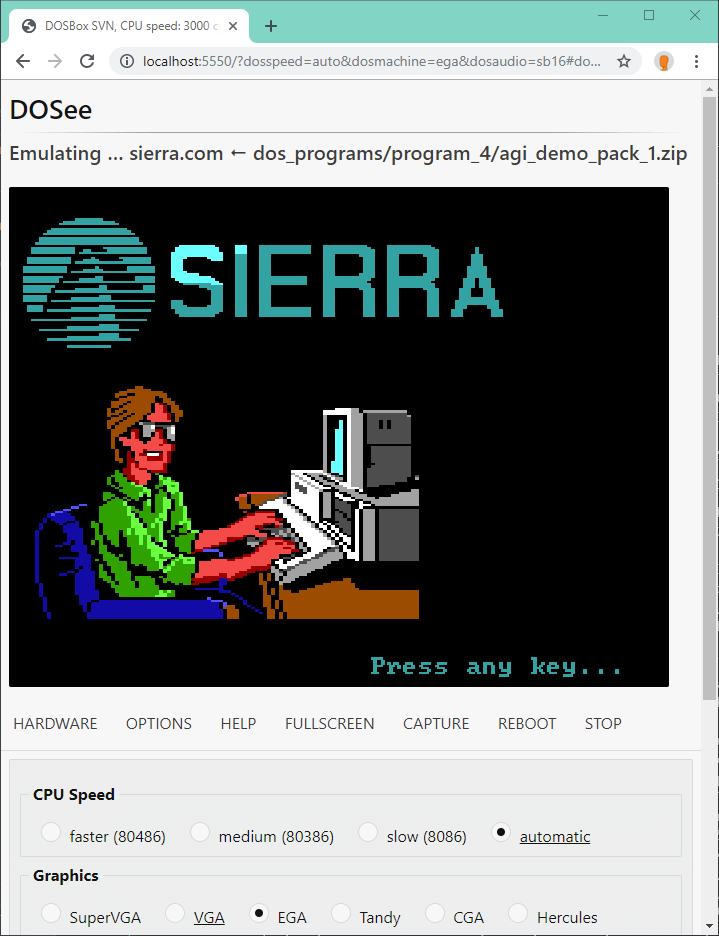

# DOSee

An MS-DOS emulator for the web.

DOSee is a front-end for an MS-DOS emulation ecosystem created by many amazing people over many years. 

DOSee itself is a fork of [The Emularity](https://github.com/db48x/emularity) project created by the Internet Archive.
[EM-DOSBox](https://github.com/dreamlayers/em-dosbox/) is a JavaScript port of [DOSBox](https://www.dosbox.com), the world's most popular MS-DOS emulator in use today.



### Dependencies and requirements

- A web browser that supports JavaScript ES6 (ECMAScript 2015).
- A local web server or a Docker installation.

### Installation

Clone DOSee.

```
git clone https://github.com/bengarrett/DOSee.git
```

Download the libraries and dependencies.

```
cd DOSee/libs
chmod +x wget_libs.sh
./wget_libs.sh
cd ..
```

__DOSee has to be served via a HTTP server, it can not be run using the browser `file:///` protocol.__

#### Python 3

```
cd DOSee
python3 -m http.server 5555
```
Point a web browser to http://localhost:5555

#### Node.js

```
cd DOSee
http-server -p 5555
```
Point a web browser to http://localhost:5555

#### Docker

Requirement:
- Docker engine: 17.04.0+
- docker-compose: 3.2

Run

```
cd DOSee
docker-compose up -d
```

Point a web browser to http://localhost:5555

Stop

```
cd DOSee
docker-compose down
```
